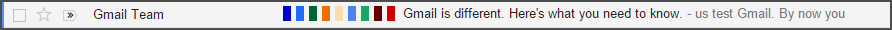

Misc-UserStyles
===============

Miscellaneous user styles unfit for their own repository.

I've uploaded the following styles to [UserStyles.org][UserStylesProfile] where
they can be configured and installed.

## Styles
* [GMail - Condensed Labels](#GMail_Condensed_Labels)
* [GMail - Hide Promotion Ads](#GMail_Hide_Promotion_Ads)
* [Google - Ad Highlighter](#Google_Ad_Highlighter)
* [JWZ - Eye Saver](#JWZ_Eye_Saver)
* [Last.fm - Show Scrobble Counts](#Lastfm_Show_Scrobble_Counts)
* [YouTube - Colored Subscribe Buttons](#YouTube_Colored_Subscribe_Buttons)

--------------------------------------------------------------------------------

<a name="GMail_Condensed_Labels" />

#### [][GMail_Condensed_Labels] [GMail - Condensed Labels][GMail_Condensed_Labels_File]

Shrinks message labels to a small text-less box until hovered.
This works best when using colored labels.

--------------------------------------------------------------------------------

<a name="GMail_Hide_Promotion_Ads" />

#### [][GMail_Hide_Promotion_Ads] [GMail - Hide Promotion Ads][GMail_Hide_Promotion_Ads_File]

Hides ads from the Promotions tab until the top border is hovered.

--------------------------------------------------------------------------------

<a name="Google_Ad_Highlighter" />

#### [][Google_Ad_Highlighter] [Google - Ad Highlighter][Google_Ad_Highlighter_File]

Attempts to make ads on Google standout a little more.

--------------------------------------------------------------------------------

<a name="JWZ_Eye_Saver" />

#### [][JWZ_Eye_Saver] [JWZ - Eye Saver][JWZ_Eye_Saver_File]

Puts to rest the old green on black terminal-style.

--------------------------------------------------------------------------------

<a name="Lastfm_Show_Scrobble_Counts" />

#### [][Lastfm_Show_Scrobble_Counts] [Last.fm - Show Scrobble Counts][Lastfm_Show_Scrobble_Counts_File]

Makes the table containing the number of scrobbles visible when viewing a
user's library.

--------------------------------------------------------------------------------

<a name="YouTube_Colored_Subscribe_Buttons" />

#### [][YouTube_Colored_Subscribe_Buttons] [YouTube - Colored Subscribe Buttons][YouTube_Colored_Subscribe_Buttons_File]

Color YouTube's subscribe buttons based on whether you already subscribe or not.

--------------------------------------------------------------------------------

[UserStylesProfile]: https://userstyles.org/users/115392
[GMail_Condensed_Labels]: https://userstyles.org/styles/108412/gmail-condensed-labels
[GMail_Condensed_Labels_File]: GMail.Condensed.Labels.user.css
[GMail_Hide_Promotion_Ads]: https://userstyles.org/styles/118365/gmail-hide-promotion-ads
[GMail_Hide_Promotion_Ads_File]: GMail.Hide.Promotion.Ads.user.css
[Google_Ad_Highlighter]: https://userstyles.org/styles/108205/google-ad-highlighter
[Google_Ad_Highlighter_File]: Google.Ad.Highlighter.user.css
[JWZ_Eye_Saver]: https://userstyles.org/styles/108208/jwz-eye-saver
[JWZ_Eye_Saver_File]: JWZ.Improved.user.css
[Lastfm_Show_Scrobble_Counts]: https://userstyles.org/styles/118344/last-fm-show-scrobble-counts-in-library
[Lastfm_Show_Scrobble_Counts_File]: Last.fm.Show.Scrobble.Counts.user.css
[YouTube_Colored_Subscribe_Buttons]: https://userstyles.org/styles/120205/youtube-colored-subscribe-buttons
[YouTube_Colored_Subscribe_Buttons_File]: YouTube.Colored.Subscribe.Buttons.user.css
